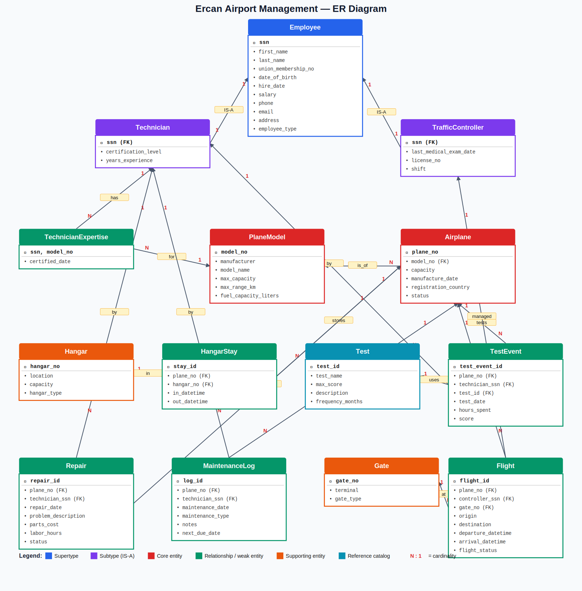

# Ercan Airport Management Information System

> **CMPE343 — Database Management Systems and Programming I**
> Term Project · Submission 24/05/2026

A complete relational database design and implementation for **Ercan Airport**, covering aircraft, hangars, technical staff, traffic controllers, airworthiness tests, repairs, maintenance, flights, and gates.

---

## 📋 Project Overview

| Item | Value |
|------|-------|
| **Tables** | 14 (well above the 8-table minimum) |
| **Relationships** | 17 |
| **Constraints** | 50+ (PK, FK, UNIQUE, CHECK, NOT NULL, ENUM) |
| **Queries delivered** | 15 management queries |
| **DBMS** | MySQL 8.0 / MariaDB 10.11 |
| **Normalisation** | 3NF throughout |

---

## 🗂️ Repository Structure

```
ercan-airport-dbms/
├── README.md                ← you are here
├── 01_DDL.sql               ← schema creation (CREATE TABLE + constraints)
├── 02_DML.sql               ← sample data for every table
├── 03_QUERIES.sql           ← 15 management queries
├── ER_diagram.svg           ← entity-relationship diagram (vector)
├── ER_diagram.png           ← entity-relationship diagram (raster)
└── docs/
    └── Project_Report.docx  ← full written report
```

---

## 🚀 How to Run

### Prerequisites

* MySQL 8.0+ or MariaDB 10.5+
* `mysql` command-line client (or any GUI such as Workbench / DBeaver)

### Build the database

```bash
# 1. Create schema
mysql -u root -p < 01_DDL.sql

# 2. Load sample data
mysql -u root -p < 02_DML.sql

# 3. Run the 15 queries
mysql -u root -p ercan_airport < 03_QUERIES.sql
```

---

## 🧱 Schema Overview

### Core entities

* **Employee** (supertype) — shared SSN, name, union number, salary, hire date
* **Technician** (subtype) — certification level, years of experience
* **TrafficController** (subtype) — medical exam date, license number, shift
* **PlaneModel** — manufacturer, capacity, range
* **Airplane** — individual airframe, links to a model

### Supporting entities

* **Hangar**, **HangarStay** (temporal — IN/OUT datetimes)
* **Test**, **TestEvent** (4-way relationship: plane × technician × test × date)
* **TechnicianExpertise** (M:N — technician ↔ model)

### Extensions beyond the minimum

* **Repair** — repair history with cost, hours, status
* **Flight** — flights linked to airplane, controller, and gate
* **Gate** — terminal boarding gates
* **MaintenanceLog** — preventive maintenance separate from tests

### ER Diagram



---

## 📊 The 15 Management Queries

| # | Question | Techniques |
|---|----------|------------|
| Q1 | Top 5 technicians by total test hours | JOIN, GROUP BY, ORDER BY, LIMIT |
| Q2 | Average test score per plane model | Multi-JOIN, AVG, MIN, MAX |
| Q3 | Traffic controllers with overdue medical exams | DATEDIFF, CASE |
| Q4 | Test events per month in 2026 | DATE_FORMAT (to_char), GROUP BY |
| Q5 | Airplanes never tested | LEFT JOIN + NULL filter |
| Q6 | Technicians expert on more than two models | HAVING, GROUP_CONCAT |
| Q7 | Hangar utilisation report | Correlated subquery |
| Q8 | Top 3 most expensive completed repairs | Multi-JOIN, computed cost |
| Q9 | Average time and score per test type | LEFT JOIN, AVG |
| Q10 | Hires in last 2 years by employee type | Date filter, GROUP BY |
| Q11 | Airplanes with failing test scores | Computed comparison, DISTINCT |
| Q12 | Distinct planes tested per technician | COUNT(DISTINCT), LEFT JOIN |
| Q13 | Plane models without a certified expert | NOT EXISTS subquery |
| Q14 | Flights handled per controller per month | DATE_FORMAT, CASE, SUM |
| Q15 | Airplanes with > 5 days total in hangar | DATEDIFF, COALESCE, HAVING |

---

## ✅ Design Highlights

* **Supertype/subtype modelling** for the Employee hierarchy — clean IS-A relationships, no NULL columns for inapplicable attributes.
* **Surrogate primary keys** for weak/relationship entities (HangarStay, TestEvent, Repair, MaintenanceLog) keep foreign keys narrow.
* **Temporal modelling** for hangar stays — open stays use `NULL` `out_datetime`.
* **CHECK constraints** enforce domain integrity at the database level (positive amounts, sensible date ranges).
* **ENUMs** instead of free text for status fields prevent dirty data.
* **ON UPDATE CASCADE** on every FK keeps the database consistent if a natural key ever changes.

---

## 👥 Team

| Name | Role | GitHub |
|------|------|--------|
| _Add team members here_ | _Role_ | _@handle_ |

---

## 📄 License

Academic project for CMPE343. Free to reuse for educational purposes.
